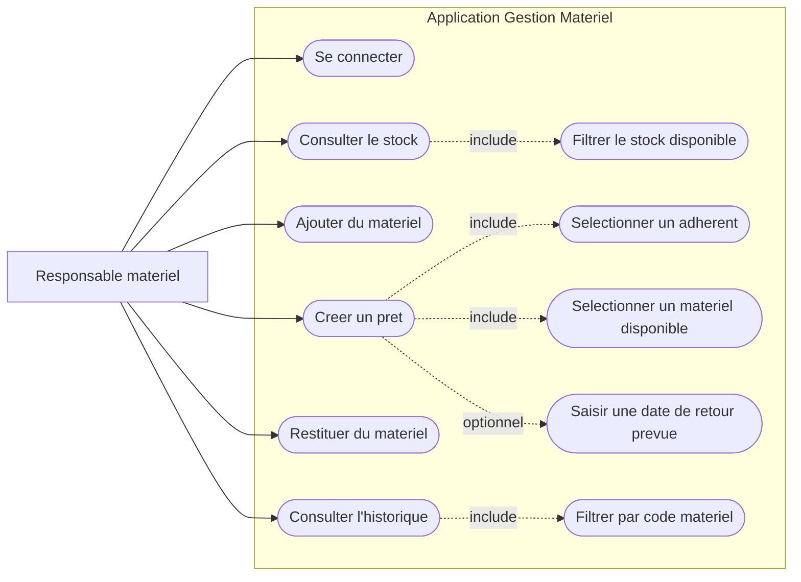
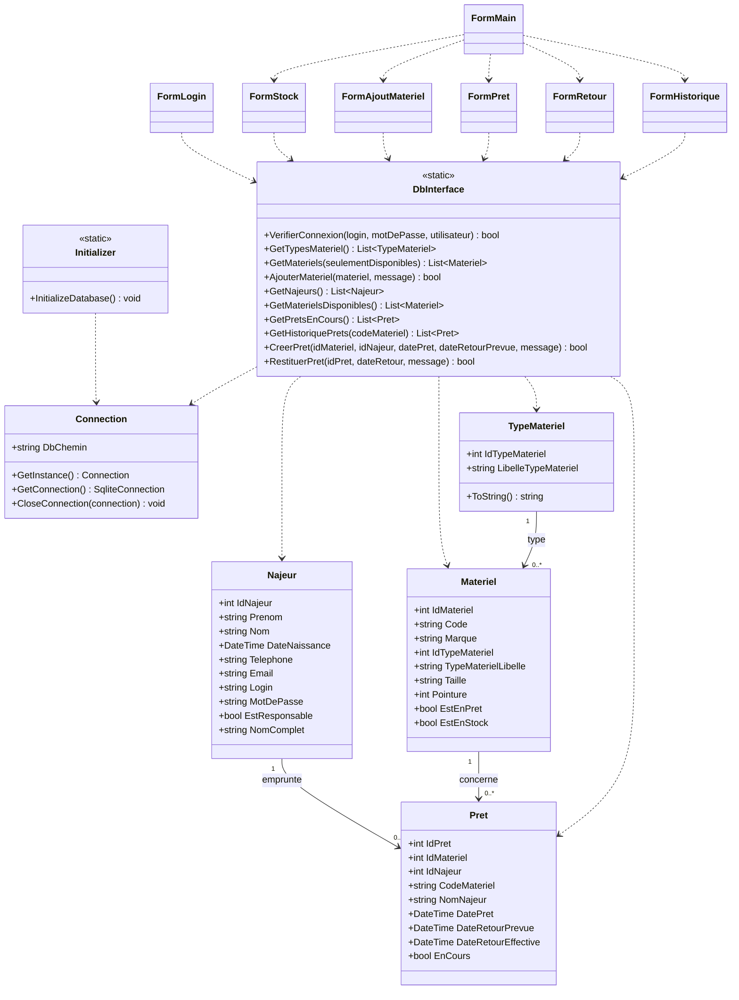
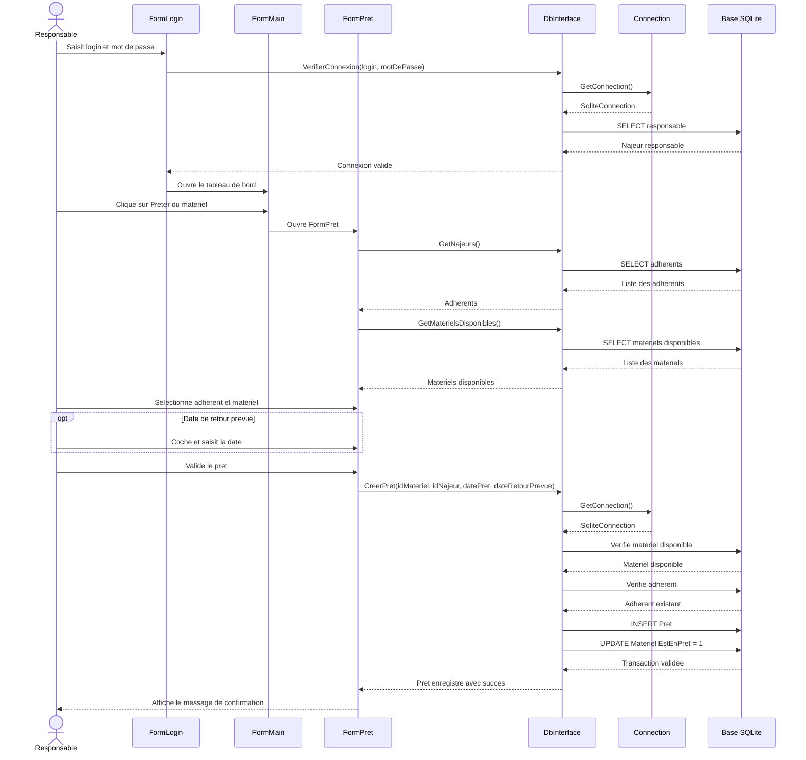

# LyonPalme - Gestion Materiel

Application client lourd Windows Forms permettant au club LyonPalme de suivre son stock de materiel et les prets aux adherents.

Le projet initialise automatiquement une base SQLite locale au demarrage, avec des donnees de demonstration pour tester rapidement l'application.

## Fonctionnalites

- Connexion reservee aux responsables materiel.
- Consultation du stock complet ou uniquement du materiel disponible.
- Ajout de materiel avec code unique.
- Gestion des types de materiel : monopalme, tuba frontal, lunettes, combinaison.
- Creation d'un pret entre un adherent et un materiel disponible.
- Saisie d'une date de retour prevue.
- Restitution d'un pret en cours avec date de retour effective.
- Historique des prets avec filtre par code materiel.

## Use cases

Acteur principal : `Responsable materiel`.

Use cases principaux :

- Se connecter a l'application.
- Consulter le stock du club.
- Filtrer le stock disponible.
- Ajouter un nouveau materiel.
- Creer un pret pour un adherent.
- Restituer un materiel prete.
- Consulter l'historique des prets.
- Filtrer l'historique par code materiel.



## Diagramme des classes



## Diagramme de sequence

Scenario : creation d'un pret de materiel.



## Technologies

- C#
- .NET `net10.0-windows`
- Windows Forms
- SQLite
- Package `Microsoft.Data.Sqlite`

## Prerequis

- Windows
- SDK .NET compatible avec `net10.0-windows`
- Visual Studio ou la CLI `dotnet`

## Installation

Cloner le projet :

```bash
git clone <url-du-repository>
cd LyonPalme-Gestion-Materiel
```

Restaurer les dependances :

```bash
dotnet restore
```

Compiler le projet :

```bash
dotnet build
```

Lancer l'application :

```bash
dotnet run --project GestionMateriel.csproj
```

## Connexion demo

Un compte responsable est cree automatiquement lors de l'initialisation de la base :

```text
Login : admin
Mot de passe : admin123
```

## Base de donnees

La base SQLite est creee automatiquement au premier lancement dans le dossier de sortie de l'application :

```text
GestionMateriel.db
```

Tables principales :

- `TypeMateriel`
- `Najeur`
- `Materiel`
- `Pret`

Des donnees de demonstration sont ajoutees avec `INSERT OR IGNORE`, ce qui permet de relancer l'application sans dupliquer les enregistrements.

## Structure du projet

```text
LyonPalme-Gestion-Materiel/
|-- DAL/
|   |-- Connection.cs
|   |-- DbInterface.cs
|   `-- Initializer.cs
|-- Forms/
|   |-- FormLogin.cs
|   |-- FormMain.cs
|   |-- FormStock.cs
|   |-- FormAjoutMateriel.cs
|   |-- FormPret.cs
|   |-- FormRetour.cs
|   `-- FormHistorique.cs
|-- models/
|   |-- Materiel.cs
|   |-- Najeur.cs
|   |-- Pret.cs
|   `-- TypeMateriel.cs
|-- GestionMateriel.csproj
|-- GestionMateriel-1.sln
`-- Program.cs
```

## Utilisation

1. Se connecter avec le compte responsable.
2. Consulter le stock depuis le tableau de bord.
3. Ajouter un nouveau materiel si besoin.
4. Creer un pret en selectionnant un adherent et un materiel disponible.
5. Restituer le materiel lorsqu'il est rendu.
6. Consulter l'historique pour suivre la tracabilite des prets.

## Notes

- Les mots de passe sont stockes en clair dans les donnees de demonstration.
- L'application est prevue pour un usage local.
- Le fichier SQLite est rattache au dossier de sortie, il peut donc etre recree apres un nettoyage du build.
